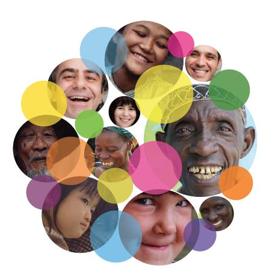

## Introduction
Hi! I am Gaotong LIU, and you can just call me Gloria. I am a Master of Science student in Biostatistics expecting to graduate in May 2021, at Mailman School of Public Health at Columbia University. 

This website has some data analysis and visualization projects for open data. I hope you can enjoy my analysis and I am welcome any discussion about the projects. You can know more about me [here](about.html). You can also [email](mailto:<gl2677@cumc.columbia.edu>) me, if you want to contact me.

## Projects
### COVID-19 DSCovR Dashboard 

How COVID-19 case and death number changes over time among states in US? 
How age, race/ethnicity and sex distribute among COVID-19 case, hospitalization and death? 
How state policies change over time? 
 

 

* The [Demographics by State COVID-19 Reporting (DSCovR) Dashboard](https://msph.shinyapps.io/dscovr_dashboard/) allows policymakers, scientists, and the lay public to visualize and compare COVID-19 time trends and demographic information among cases, hospitalizations, and deaths across states.

* Meta analysis to study comorbidity and COVID-19 case and death(Waiting for publication).
### Machine Learning Prediction Project

### House Sale Price Regression Models
* Using Linear regression model, Ridge regression, Lasso, Kth nearest neighbors algorithm (Knn), Principal com- ponent regression (PCR), Partial least squares (PLS), Generalized additive model(GAM) and Multivariate adaptive regression splines (MARS) to find an optimal regression model to predict the final sale price of each house.Detailed Report can be accessed [here](gl2677_mtd_project.html).

### Red Wine Quality Classification Models
* Applied Linear Discrimininant analysis (LDA), Quadratic Discrimininant analysis (QDA), k-Nearest-Neighbor classifiers (KNN), Classification tree, Random Forest, Boositng(AdaBoost) and Support Vector Machine (SVM) to predict red wine quality based on physicochemical tests. Detailed Report can be accessed [here](final_report.html).

### World Happiness Report

Are people getting happier over time?
Why people are happier? 
Is happiness related to sucide rate and terrorism?

* To visualize the global happiness trend, I draw a [Global animation Map](global_animation_plot.html).

* To visulaize the relationship between happiness and sucide or terrorism, I create a [Shinny Dashboard](https://yuqimiao.shinyapps.io/Rshinny/).

* To analysis the covariates of the happiness, I use correlation plots and [Mutiple Linear Regression](MLR.html).